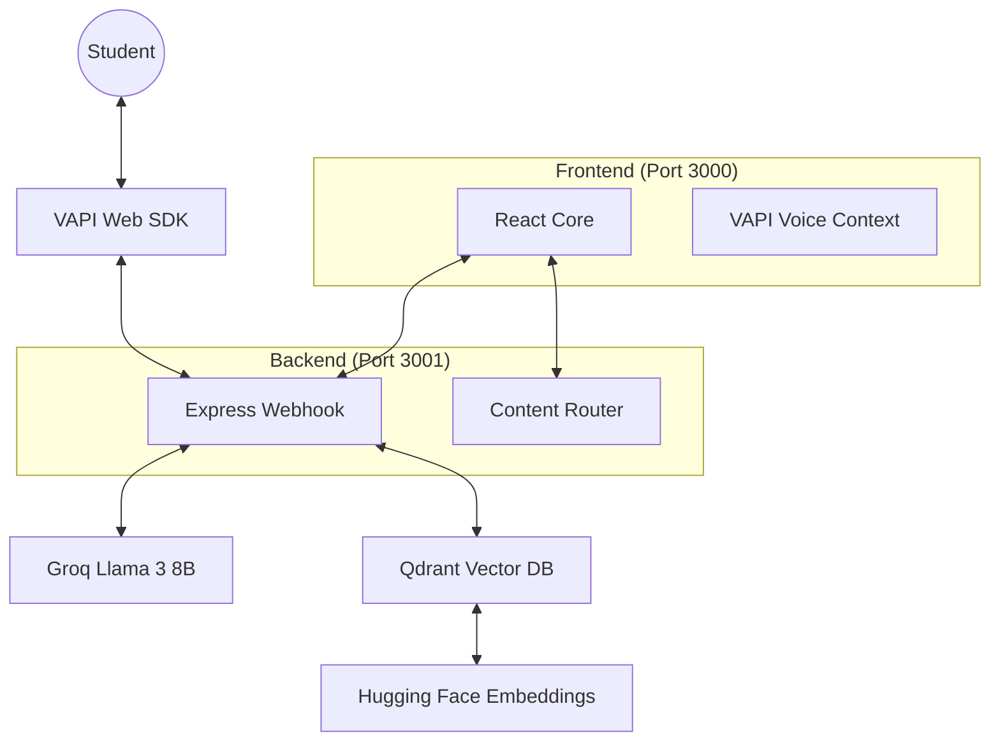

# 🎙️ Drishti-Vani: Voice-First Accessible Learning

> **Empowering visually impaired students through a conversational, NCERT-aligned AI tutor.**

Drishti-Vani is a modern, voice-first learning platform built to bridge the accessibility gap for visually impaired students. By combining low-latency voice AI with context-aware RAG (Retrieval-Augmented Generation), students can learn, ask questions, and take assessments entirely through natural conversation.

---

## 🚀 The Core Stack

Drishti-Vani uses a decentralized, best-of-breed AI stack to ensure high performance and low latency:

- **Voice SDK**: [VAPI Web SDK](https://vapi.ai) — Provides near-instant, human-like voice interaction.
- **Inference**: [Groq](https://groq.com) (**Llama 3 8B**) — Blazing-fast chat completions for tutoring and semantic grading.
- **Embeddings**: [Hugging Face](https://huggingface.co) (**all-MiniLM-L6-v2**) — Compact, 384-dimensional semantic vectors.
- **Vector DB**: [Qdrant](https://qdrant.tech) — High-performance vector storage for NCERT curriculum retrieval.
- **Frontend**: React + TypeScript + Tailwind CSS.
- **Backend**: Express.js (Modular Router Architecture).

---

## ✨ Key Features

- **Ambient Q&A**: Ask questions from any screen. Our RAG pipeline retrieves the relevant NCERT context and answers instantly via Llama 3.
- **Semantic Assessment**: Beyond simple keyword matching. The AI understands the *intent* and *depth* of open-ended voice answers to provide meaningful feedback.
- **Voice-First Navigation**: Move through chapters, resume last sessions, and check progress using simple commands like "Continue learning" or "Open Science".
- **Dynamic Curriculum**: Content structure is served from a modular backend, allowing for easy updates to NCERT chapters.
- **Split-Screen UX**: While optimized for screen readers, the visual interface maintains a clean, accessible split-screen design for low-vision users.

---

## 🛠️ Quick Start Guide

### 1. Prerequisites
- Node.js (v18+)
- Qdrant Cloud or Local Instance
- API Keys: VAPI, Groq, Hugging Face

### 2. Environment Setup
Create a `.env` file at the root (use `.env.example` as a template):
```env
# VAPI
REACT_APP_VAPI_PUBLIC_KEY=...
VAPI_PRIVATE_KEY=...
REACT_APP_VAPI_ASSISTANT_ID=...

# Qdrant
QDRANT_URL=...
QDRANT_API_KEY=...

# AI Inference
GROQ_API_KEY=...
HF_API_KEY=...
```

### 3. Installation
```bash
npm install           # Install root dependencies (concurrently, etc.)
cd server && npm install # Install backend dependencies
cd ..
```

### 4. Seed the Curriculum
Initialize the vector database with the NCERT curriculum using the Hugging Face embedding pipeline:
```bash
cd server
npm run ingest
cd ..
```

### 5. Launch the Demo
Run both the React frontend and Express backend concurrently:
```bash
npm run dev
```
Navigate to `http://localhost:3000` to start your learning journey!

---

## 🗺️ System Architecture



---

## 📖 Voice Commands to Try
- **"Start learning"** - Begin your first session.
- **"Science Chapter 4"** - Jump directly to a topic.
- **"Explain the bell jar experiment"** - Trigger context-aware RAG tutoring.
- **"What is my progress?"** - Check your statistics.

---

Made with ❤️ for HackBlr 2026.
